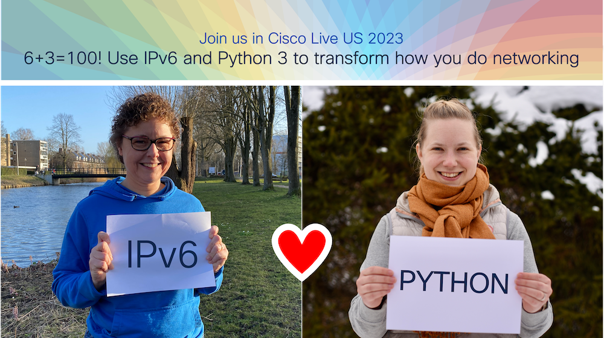

# 6+3=100! Use IPv6 and Python 3 to transform how you do networking

This repository includes the supplemental material for the Cisco Live Technical Seminar TECENT-2150 (delivered in Cisco Live US 2023). In this repository you can find the code for demos that were delivered during the session.



All the scripts have been tested against the DevNet reservable sandbox on May 2023: **[IOS XE on Cat 8kv Latest Code](https://devnetsandbox.cisco.com/RM/Diagram/Index/a5823504-3391-47cc-93a4-8bcadc701839?diagramType=Topology)** (Requires login with DevNet credentials)

> **Note**: Except for the chapter 4, all the scripts can be run against the sandbox. Chapter 4 configuration changes work as well, however due to the limitation of the Sandbox internet connectivity, the ping test will fail also after the configuration change has been deployed.

## Prepare to run the code

### Enable RESTCONF on your network device

RESTCONF is already enabled in the DevNet reservable C8Kv sandbox. If you are running the code against some other IOS XE, you might need to first enable RESTCONF on that network device.

```bash
conf t
# create credentials for the connection 
 username developer privilege 15 secret C1sco12345

# Enable HTTPS
 ip http secure-server 

# enable RESTCONF
 restconf

```

### Prepare your developer environment

To run and edit the code, you need to following:

- Install Python version 3
- Install Git
- Install a code editor, for example Visual Studio Code

Not sure how to do these? DevNet has great learning material to get you through these steps. You will need a free DevNet account to access the material, so register [here](https://developer.cisco.com/) if you haven't, and enjoy the learning labs to get your developer environment started:

* Windows: https://developer.cisco.com/learning/modules/dev-setup/dev-win/step/1
* Mac: https://developer.cisco.com/learning/modules/dev-setup/dev-mac/step/1
* Linux (Ubuntu): https://developer.cisco.com/learning/modules/dev-setup/dev-ubuntu/step/1

### Clone the repo and install requirements

When you have your developer environment up and running, make sure you install all libraries and modules required for your scripts. To keep your developer environment tidy, make sure to activate your virtual environment before installing the libraries.

Clone this repository to the environment in which your are working:
```bash
git clone https://github.com/juuliasantala/TECENT-2150.git
```

Install the requirements to have all the necessary libraries for the code examples to work.

> **Warning**: pyATS is not supported on Windows. If running the scripts on Windows, recommendation is to run pyATS in a container (see [chapter 3](./chapter_3/README.md)). You also skip the pyATS scripts and just run the configuration changes.

```bash
pip install -r requirements.txt 
```

## Authors & Maintainers
* Juulia Santala (jusantal@cisco.com)

## License
This project is licensed to you under the terms of the [Cisco Sample Code License](LICENSE).
